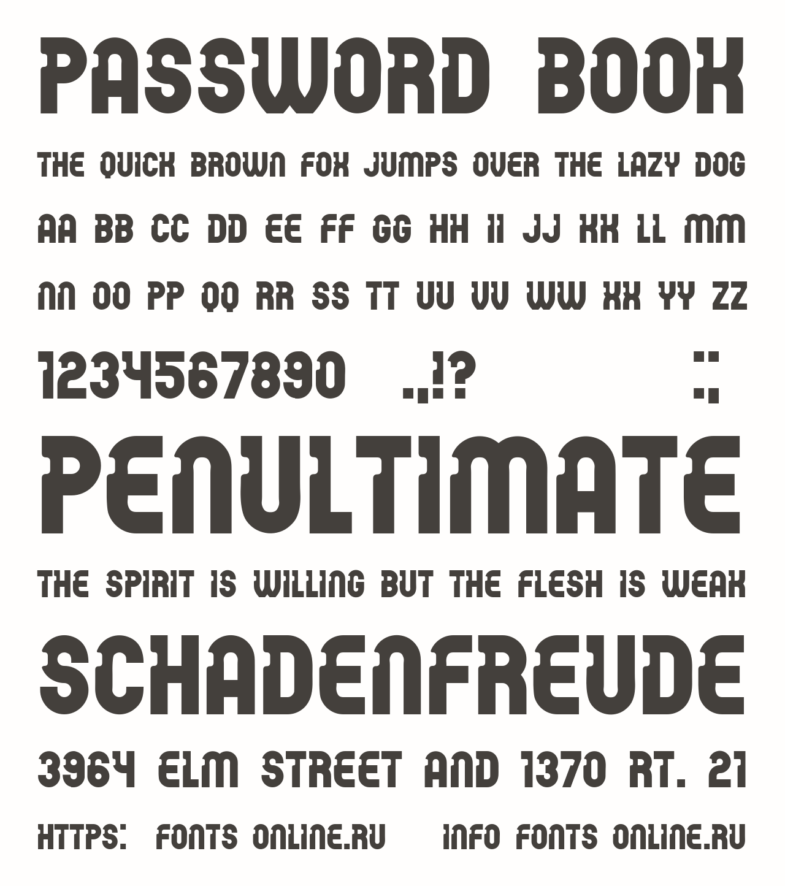

# Password

# Password font

A password, sometimes called a passcode, is secret data, typically a string of characters, usually used to confirm a user's identity.

## Variable Font Axe
Password has the following axe:

Axis | Tag | Default | Static Instances
--- | --- | --- | ---
Weight | wght | 400 | Regular

## License

This Font Software is licensed under the SIL Open Font License, Version 1.1.
This license is available with a FAQ at [https://openfontlicense.org](https://openfontlicense.org)
